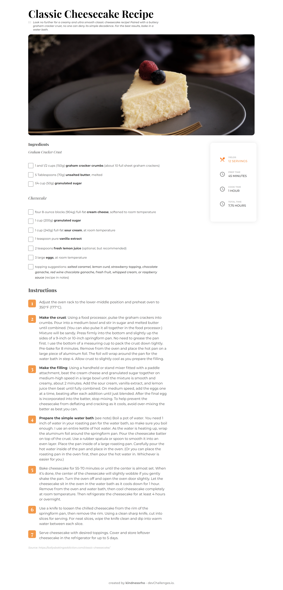

# recipe-page

<!-- Please update value in the {}  -->

<h1 align="center">Recipe Page</h1>

   Solution for a challenge from  <a href="http://devchallenges.io" target="_blank">Devchallenges.io</a>.

  <h3>
    <a href="https://recipepage-devchallenge.netlify.app/">
      Demo
    </a>
     | 
    <a href="https://github.com/kindnessrho/recipe-page">
      Solution
    </a>
     | 
    <a href="https://devchallenges.io/challenges/OEKdUZ6xs0h99C38XVht">
      Challenge
    </a>
  </h3>

<!-- TABLE OF CONTENTS -->

## Table of Contents

- [Overview](#overview)
  - [Built With](#built-with)
- [Features](#features)
- [Contact](#contact)
- [Acknowledgements](#acknowledgements)

<!-- OVERVIEW -->

## Overview

A devchallenges.io challenge to build a [ RECIPE PAGE](https://devchallenges.io/challenges/Jymh2b2FyebRTUljkNcb) using HTML AND CSS. [Check out my solution here](https://recipepage-devchallenge.netlify.app/).
This challenge has helped to improve on using flexbox and css grid.

### Built With

<!-- This section should list any major frameworks that you built your project using. Here are a few examples.-->

- [HTML](https://html.com/)
- [CSS](https://developer.mozilla.org/en-US/docs/Web/CSS)

## Features

<!-- List the features of your application or follow the template. Don't share the figma file here :) -->

This application/site was created as a submission to a [DevChallenges](https://devchallenges.io/challenges) challenge. The [challenge](https://devchallenges.io/challenges/OEKdUZ6xs0h99C38XVht) was to build an application to complete the given user stories.

## Acknowledgements

<!-- This section should list any articles or add-ons/plugins that helps you to complete the project. This is optional but it will help you in the future. For exmpale -->

- [Steps to replicate a design with only HTML and CSS](https://devchallenges-blogs.web.app/how-to-replicate-design/)
- [Node.js](https://nodejs.org/)
- [Marked - a markdown parser](https://github.com/chjj/marked)

## Contact

- Website [kindnessrho](https://kindnessrho.netlify.app)
- GitHub [@kindnessrho](https://{github.com/kindnessrho)
- Twitter [@kindnessrho](https://{twitter.com/kindnessrho)
